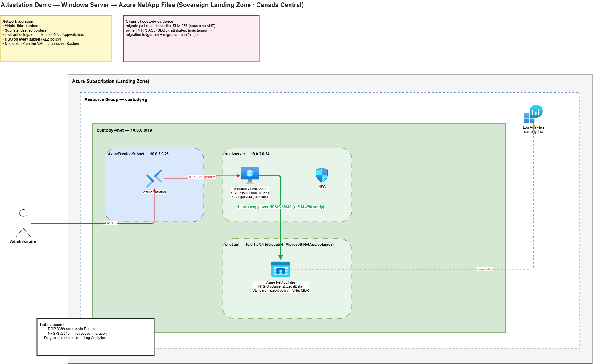
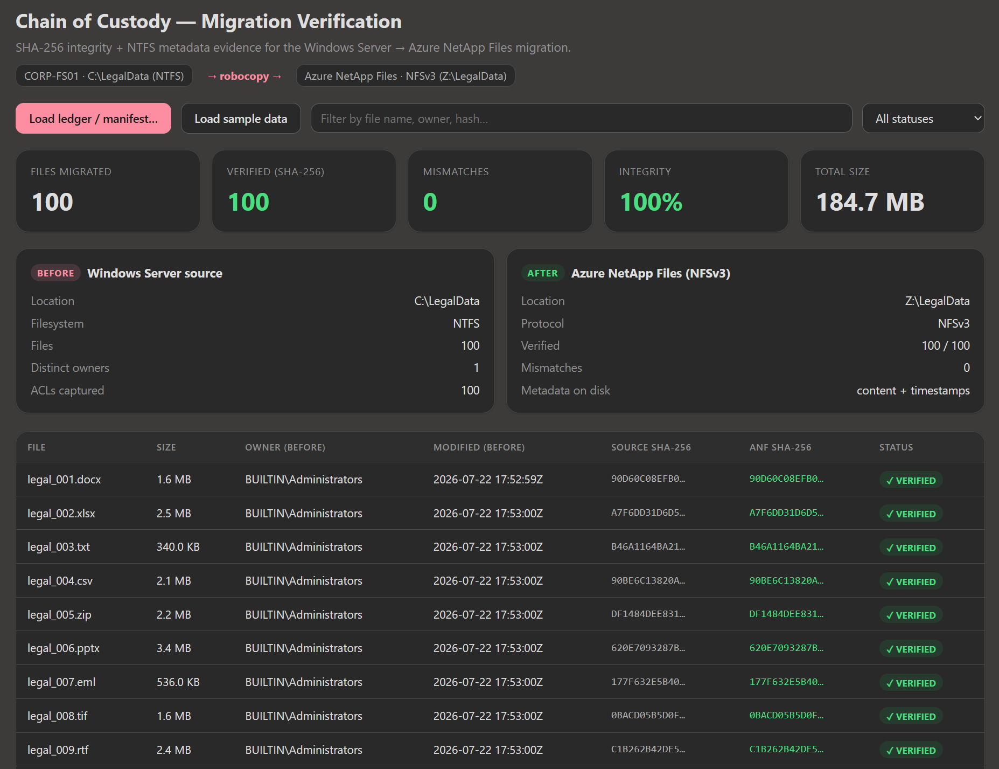

# Attestation Demo — Windows Server → Azure NetApp Files

Azure infrastructure, deployed with **Bicep IaC**, demonstrating a
cryptographically verifiable attestation for files migrated from a
Windows file server to Azure NetApp Files.

The deployment includes **Windows Server 2019** source file server
(seeded with 100 legal files), which mounts the **Azure NetApp Files** NFSv3
volume and migrates the data with **robocopy** + SHA-256 verification. **Azure
Bastion** provides private RDP (the VM has no public IP).

---

## Architecture



---

## Project Structure

```
anf-attestation/
├── README.md                          ← Attestation demo README
├── bicep/
│   ├── main.bicep                     ← Subscription-scoped orchestration
│   ├── main.bicepparam                ← Parameters
│   ├── modules/
│   │   ├── resource-group.bicep       ← Resource group
│   │   ├── log-analytics.bicep        ← Log Analytics workspace
│   │   ├── virtual-network.bicep      ← VNet + subnets
│   │   ├── netapp-account.bicep       ← ANF account + pool + volume
│   │   ├── policy-exemptions.bicep    ← SLZ DDoS Modify waiver (RG-scoped)
│   │   ├── bastion.bicep              ← Azure Bastion (private RDP/SSH)
│   │   ├── windows-server.bicep       ← Win2019 source FS + 100-file seed + robocopy/NFSv3 migrate.ps1
│   │   └── diagnostic-settings.bicep  ← ANF metrics → Log Analytics
│   └── scripts/
│       └── deploy.sh                  ← One-shot subscription-scope deploy
├── dashboard/
│   └── attestation-dashboard.html         ← Before/after evidence viewer (drag-drop ledger)
└── diagrams/
    └── attestation-architecture.drawio    ← Architecture diagram
```

---

## Prerequisites

| Tool | Version | Purpose |
|------|---------|---------|
| Azure CLI | ≥ 2.51 | Deploy Bicep, authenticate |
| Bicep CLI | auto-installed by deploy.sh | Compile Bicep → ARM |
| Windows RDP client | any | Connect to the source server via Bastion |

**Azure permissions required:**

- `Owner` or `Contributor` on the subscription
  (needed to create resource groups and deploy resources)
- ANF resource provider registered: `az provider register -n Microsoft.NetApp`

---

## Step-by-Step Deployment

### 1. Set the VM admin password (workload VM)

The Windows Server needs a local admin password. It is read from an
environment variable so the secret is never committed:

```bash
export CUSTODY_VM_ADMIN_PASSWORD='<a strong password>'   # 12+ chars, upper/lower/digit/symbol
```

(To skip the VM/Bastion entirely, set `deployWorkloadVms = false` in
`bicep/main.bicepparam`.)

### 2. Register the NetApp resource provider (once per subscription)

```bash
az provider register -n Microsoft.NetApp --wait
```

### 3. Deploy all infrastructure

```bash
cd anf-attestation
bash bicep/scripts/deploy.sh
```

This single command:
- Runs `az deployment sub create` (subscription scope)
- Creates the resource group, VNet, ANF account + pool + volume,
  Log Analytics workspace, Bastion, the Windows Server, and all diagnostic settings
- Prints the Windows → ANF migration showcase steps (Bastion RDP + `migrate.ps1`)

**Estimated deployment time: 10–15 minutes** (ANF volume provisioning is the
longest step).

### 3b. Live migration showcase (Windows Server → ANF via robocopy)

The Windows Server (`CORP-FS01`) hosts 100 seeded legal files in `C:\LegalData`.
The deployment installs the NFS client and drops `C:\demo\migrate.ps1`. To
run the live migration:

```powershell
# 1. RDP to the Windows Server through Bastion (names are printed by deploy.sh)
az network bastion rdp --name <bastion> --resource-group anf-attestation-rg \
  --target-resource-id $(az vm show -g anf-attestation-rg -n <windows-vm> --query id -o tsv)

# 2. In an elevated PowerShell on the server, run the migration
C:\demo\migrate.ps1
Get-Content C:\demo\migration-ledger.csv
Get-Content C:\demo\migration-manifest.json
```

`migrate.ps1` mounts the ANF NFSv3 volume as drive `Z:`, robocopies
`C:\LegalData` to it, then computes source and destination SHA-256 hashes for
every file and writes a `VERIFIED`/`MISMATCH` ledger — the chain-of-custody
proof that data arrived on ANF intact.

Because NFSv3 can't store NTFS ACLs, the script also captures each file's
**owner, ACL (SDDL), DOS attributes, and created/modified timestamps** from the
Windows source into `migration-ledger.csv` and a richer
`migration-manifest.json`. The metadata is preserved as signed *evidence*
alongside the content hashes rather than on the destination filesystem
(`robocopy /COPY:DAT /DCOPY:DAT` still carries data + timestamps to ANF).

---

## Evidence Dashboard

`dashboard/attestation-dashboard.html` is a self-contained, single-file viewer
for the attestation evidence produced by the migration. Open it directly
in any browser — **everything runs locally and no data ever leaves the page**.

Load `migration-ledger.csv` or `migration-manifest.json` (drag-and-drop or the
**Load ledger / manifest…** button), or click **Load sample data** to preview
the layout without a real run. Capabilities:

- **Summary cards** — total files, verified count, mismatches, and bytes migrated
  at a glance.
- **Before / After panels** — side-by-side view of the Windows Server (NTFS)
  source versus the Azure NetApp Files (NFSv3) destination.
- **Per-file verification table** — file name, size, owner, modified timestamp,
  and both the **source** and **ANF** SHA-256 hashes with a
  `VERIFIED` / `MISMATCH` status for every file.
- **Search and filter** — filter rows by file name, owner, or hash, and narrow
  to verified-only or mismatches-only.
- **Sortable columns** and a footer summary of the overall attestation result.
- **Clawpilot light/dark theming** that follows your system preference.

This gives auditors a fast, tamper-evident way to confirm that all 100 legal
files arrived on ANF intact, with NTFS metadata preserved as attestation evidence.



---

## Azure Monitor Audit Trail

In addition to the on-server evidence (`migration-ledger.csv` /
`migration-manifest.json`), ANF volume activity is captured in
**Azure Monitor / Log Analytics**:

| Resource | Log category | Retention |
|----------|-------------|-----------|
| ANF volume | AllMetrics (throughput, latency, used capacity) | 90 days |

Query in Log Analytics:

```kusto
// ANF volume used-capacity trend over the last 24 hours
AzureMetrics
| where TimeGenerated > ago(24h)
| where ResourceProvider == "MICROSOFT.NETAPP"
| where MetricName == "VolumeLogicalSize"
| project TimeGenerated, Resource, Average
| order by TimeGenerated desc
```

---

## Security Design

| Control | Implementation |
|---------|---------------|
| Private-only compute | Windows Server has no public IP; access via Azure Bastion |
| No public NFS access | ANF volume is reachable only from inside the VNet |
| NFS export restriction | ANF export policy allows only the VNet CIDR |
| Network segmentation | NSGs attached to every subnet (deny-by-default posture) |
| Content integrity | SHA-256 hash of every file verified source vs ANF |
| Audit logging | Azure Monitor diagnostic settings → Log Analytics |

---

## Teardown

```bash
RG="anf-attestation-rg"   # or use the resource group name printed by deploy.sh
az group delete --name "$RG" --yes --no-wait
echo "Deletion initiated for resource group: $RG"
```
